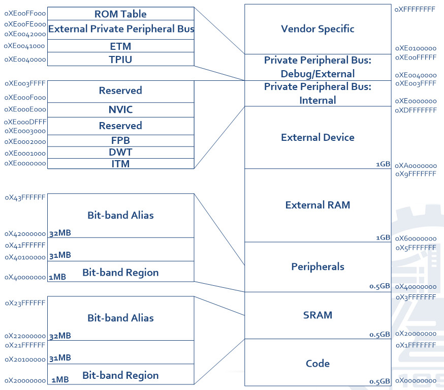
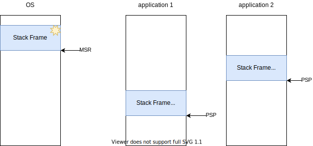
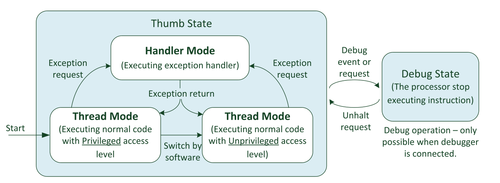
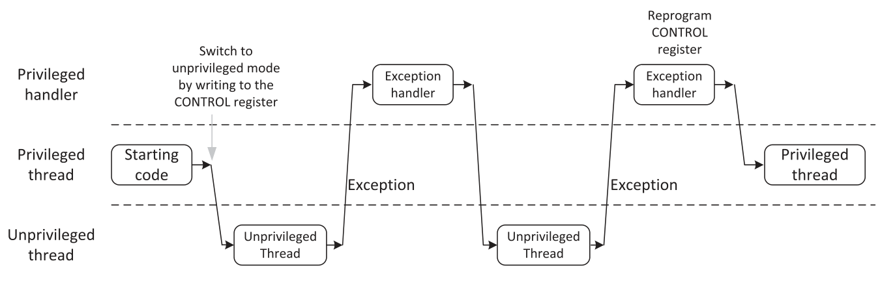
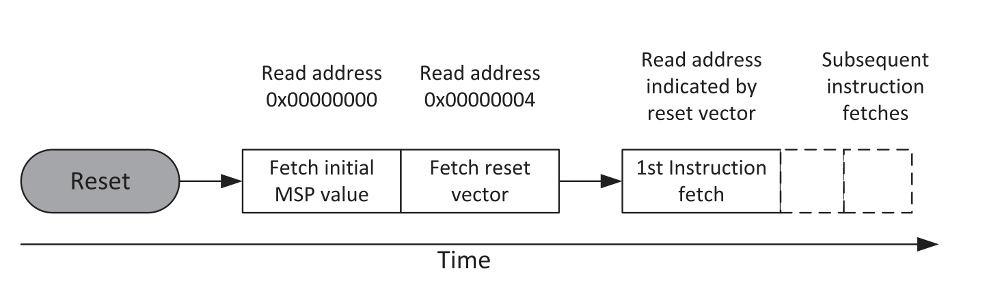
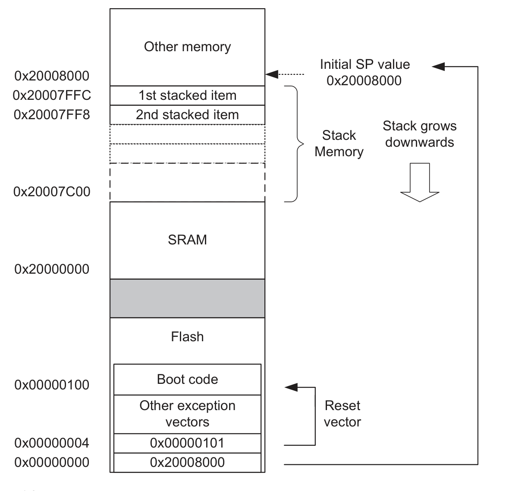
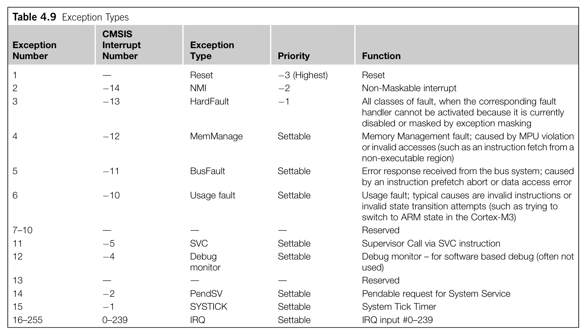
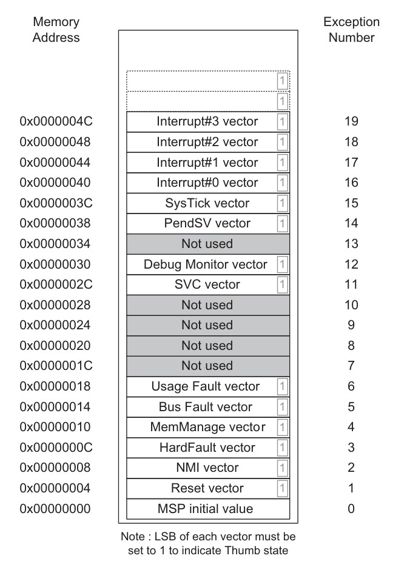
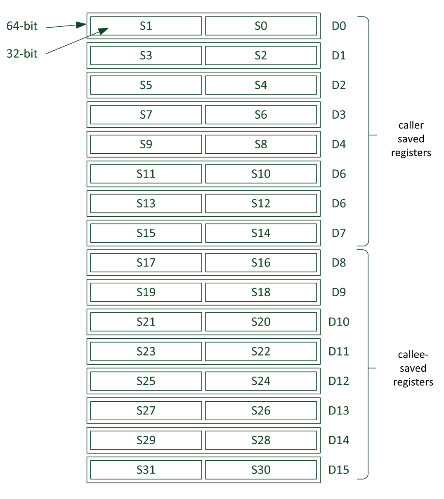
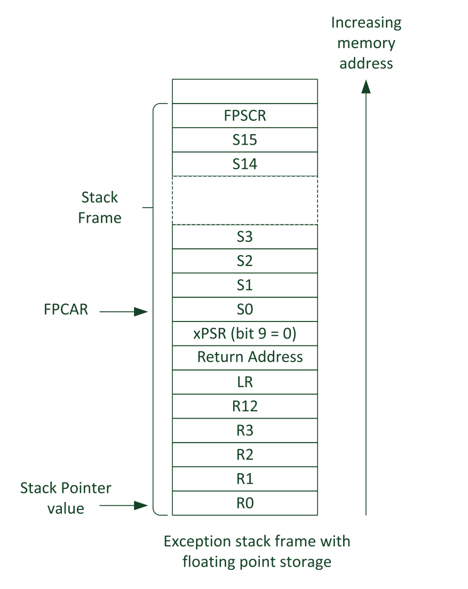

# cese-adm-workspace
Prácticas de la asignatura Arquitectura de Microprocesadores, dictada en el marco de la Carrera de Especialización en Sistemas Embebidos de la FIUBA

## Preguntas Orientadoras

### Describa brevemente los diferentes perfiles de familias de microprocesadores/microcontroladores de ARM. Explique alguna de sus diferencias características
ARM presenta la siguiente familia de microcontroladores:
* `Cortex-A` (**A**pplication): Son dispositivos pensados para aplicaciones de alta performance, que normalmente corren sistemas operativos de propósito general (ie android/linux). Soportan instrucciones tanto de 32 como de 64 bits. Debido a esto es usual encontrarlos en dispositivos de consumo masivo como smartphones.
* `Cortex-R` (**R**eal-time): Estos están pensados para usarse en aplicaciones críticas (por ejemplo, en la industria automotriz). Su arquitectura es similar a la del cortex-A, pero incorporan mas herramientas de control de memoria y manejo de excepciones. Normalmente son dispositivos son dual-core que permiten correr en modo *lockstep*, en el que el mismo set de instrucciones corre en paralelo. Esta redundancia permite detectar y corregir errores, y hace el sistema más tolerante a fallos.
* `Cortex-M` (**M**icrocontroller): Son procesadores de 32 bits optimizados para correr aplicaciones específicas/dedicadas (es decir, no de uso general) en sistemas embebidos compaactos.

## Cortex-M

### Describa brevemente las diferencias entre las familias de procesadores Cortex M0, M3 y M4

* **Cortex-M0(+)**: Su arquitectura es la **ARMv6-M** (Von Neumann). El Cortex-M0+ es un set optimizado del Cortex-M0 original. Está pensado para aplicaciones relativamente sencillas de bajo consumo y bajo costo. Su pipeline de instrucciones es de 2 etapas.
* **Cortex-M3**: Su arquitectura es la **ARMV7-M** (Harvard). El pipeline es de 3 etapas, y la incorporación de un `Systick Timer` lo hace apto para correr RTOS.
* **Cortex-M4(F)**: Su Arquitectura es la **ARMv7E-M** (Harvard). Conceptualente, el Cortex-M4F es un M3 con el agregado de instrucciones de DSP y una unidad de punto flotante (FPU) de simple precisión.
* **Cortex-M7(F)**: Es la arquitectura más potente del segmento. Posee un pipeline de 6 etapas con *branch prediction*, y su FPU es capaz de trabajar tanto en simple como doble precision.

### Por qué se dice que el set de instrucciones Thumb permite mayor densidad de código?
Al contrario que su predecesor (el set de instrucciones ARM), las instrucciones Thumb se encuentran codificadas de una forma más compacta (usando 16 bits). Esto significa que la representación binaria de estas instrucciones es más pequeña, por lo que se ocupa menos memoria (instrucciones más pequeñas resultan en código más denso ya que la misma funcionalidad puede ser codificada con menos bytes).

Por otro lado, el set de instrucciones Thumb suele usar menos registros para las operaciones, a comparación del set de instrucciones ARM completo. Esto impacta en tener que alocar menos memoria para guardar/manipular registros.

Finalmente, el set de instrucciones Thumb soporta ejecución condicional, permitiendo que se pueda ejecutar una instrucción solo si una condición específica se cumple. Esta característica reduce la necesidad de branchear al mismo tiempo que el código resultante es más compacto.

### Qué entiende por arquitectura load-store? Qué tipo de instrucciones no posee este tipo de arquitectura?
Una arquitectura del tipo `load-store` se refiere a la forma en la que las instrucciones son ejecutadas. En una arquitectura `load-store`, la mayoría de operaciones aritmético-lógicas se ejecutan exclusivamente en los registros del CPU (ie `r0-r12`). Es decir, las operaciones no acceden a los datos almacenados en memoria directamente, si no que previamente deben haber sido movidos a alguno de los registros de uso general.

Por ejemplo, si se desea sumar dos números, primero deben almacenarse sus valores desde la memoria a registros, luego sumar sus valores y finalmente guardar este resultado de nuevo en memoria si fuera necesario.

### Cómo es el mapa de memoria de la familia?
Dado que estamos hablando de una arquitectura de 32 bits, se pueden direccionar `2^32 - 1` direcciones (4Gib) En el caso de ARM, esta región de memoria se distribuye para
* Memoria de programa
* Memoria de datos
* Periféricos, tanto propietarios como comunes (ie NVIC).



### ¿Qué ventajas presenta el uso de los “shadowed pointers” del PSP y el MSP?
Un "shadowed stack pointer" permite que el stack de código privilegiado y no privilegiado se encuentren en diferentes regiones de memoria, lo que termina mejorando la estabilidad/confiabilidad del sistema.



Las tareas no provilegiadas usarán el `PSP` (`Process Stack Pointer`) mientras que las privilegiadas (usualmente el scheduler/kernel de un RTOS o el mismo código baremetal) usará el `MSP` (`Main Stack Pointer`). De este modo, cuando ocurran excepciones/interrupciones el procesador puede usar directamente el `MSP` sin tener que preocuparse sobre manejar el `PSP`.

### Describa los diferentes modos de privilegio y operación del Cortex M, sus relaciones y cómo se conmuta de uno al otro. Describa un ejemplo en el que se pasa del modo privilegiado a no priviligiado y nuevamente a privilegiado.

El Cortex-M es una arquitectura que ofrece dos modos de privilegio y operación principales: el modo de Privilegio Principal (Privileged) y el modo de No Privilegio (Unprivileged). Estos modos permiten controlar el acceso a ciertas funciones y recursos críticos del sistema.

En el modo privilegiado, el procesador tiene acceso completo a todos los recursos del sistema y a todas las instrucciones.Por otro lado, el código que se ejecuta en este modo generalmente es el kernel/scheduler del sistema operativo, por lo que es razonable que pueda acceder a instrucciones de configuración de interrupciones, funciones de administración de energía y registros de control especiales.

En contraparte, en el modo no privilegiado el procesador tiene un acceso limitado a los recursos y no puede ejecutar ciertas instrucciones. El código en este modo suele ser el código de las tareas de usuario, que no necesita acceso a recursos críticos.



Tanto el modo privilegiado como el no privilegiado son parte de lo que en la arquitectura se conoce como `Thread Mode`. El cambio entre un modo y otro se hace modificando un registro especial denominado `CONTROL`.

Además de este modo Thread, se encuentra el `Handler Mode`, el cual ocurre cuando una excepción se dispara. En este modo, el procesador siempre tiene un nivel de acceso privilegiado.

Una vez que el procesador entra en modo Thread no privilegiado, no puede regresar directamente al modo privilegiado. Para que esto suceda, debe primero ocurrir una excepción (por ejemplo la del SysTick o una SVC, Supervisor Call) de modo que el procesador vuelva a tener los privilegios necesarios como para modificar el registro `CONTROL`.




### ¿Qué se entiende por modelo de registros ortogonal? Dé un ejemplo
Un modelo de registros ortogonal se refiere a un diseño de arquitectura de procesadores en el que los registros de propósito general pueden utilizarse de manera más flexible e intercambiable en una variedad de instrucciones y operaciones. En otras palabras, en un modelo ortogonal, no hay restricciones rígidas sobre qué registros pueden ser fuente o destino en instrucciones específicas. Esto aporta versatilidad a la arquitectura, lo que puede simplificar la programación y la compilación.

```
add r1, r2, r3  // Sumo r1 = r2 + r3 (r1 es destino)
sub r4, r1, r5  // Resto r4 = r1 - r5 (r1 es fuente)
usat r1, #12, r1 // Saturo r1 a 12 bits (r1 es fuente y destino)
```

### ¿Qué ventajas presenta el uso de intrucciones de ejecución condicional (IT)? Dé un ejemplo
Las instrucciones de ejecución condicional permiten ejecutar instrucciones condicionalmente en función de una evaluación de banderas de estado (flags) sin requerir saltos (branch) explícitos. Esto proporciona ventajas significativas:

* Código más compacto: Al eliminar la necesidad de saltos condicionales explícitos, el código resultante suele ser más compacto y eficiente en términos de uso de memoria.

* Mejora de la predicción de saltos: La ausencia de saltos condicionales significa que no hay saltos que puedan ser mal predichos por la unidad de predicción de saltos del procesador, lo que ayuda a evitar penalizaciones en el rendimiento.

* Menos riesgo de saltos mal predichos: Al minimizar el uso de saltos condicionales, se reduce el riesgo de saltos mal predichos, lo que podría llevar a un rendimiento más predecible en términos de ciclos de reloj.

* Facilita el paralelismo del compilador: Los compiladores pueden generar código más eficiente y paralelo al aprovechar las instrucciones de ejecución condicional.

* Más legible: El uso de instrucciones de ejecución condicional puede hacer que el código sea más legible y fácil de seguir, ya que la condición de ejecución se establece claramente en el código.

```
cmp r0, r1         // Compara r0 y r1
ite gt             // Si r0 > r1, ejecuta la siguiente instrucción; de lo contrario, salta a la siguiente instrucción.
movgt r2, r0       // Si r0 > r1, copia el valor de r0 en r2
movle r2, r1       // Si r0 <= r1, copia el valor de r1 en r2
```

### Describa brevemente las excepciones más prioritarias (reset, NMI, Hardfault).
* Reset: Esta es la excepción de mayor prioridad y ocurre cuando se enciende o reinicia el microcontrolador. La excepción de reinicio se encarga de configurar el sistema inicialmente, incluyendo la configuración de registros de control, vectores de interrupción y la inicialización de memoria. Es la excepción que da inicio a la ejecución del programa.

* NMI (Non-Maskable Interrupt - Interrupción no enmascarable): La NMI es la segunda excepción de mayor prioridad. Es "no enmascarable" porque no puede ser deshabilitada o bloqueada por un usuario o el sistema operativo. Se utiliza para eventos críticos que requieren una atención inmediata, como fallos de hardware, supervisión de seguridad o eventos externos que no deben ser ignorados.

* Hard Fault: Es la tercera excepción de mayor prioridad. Se produce cuando ocurre un error grave o una excepción sin manejo adecuado. Puede ser causada por una variedad de condiciones, como intentos de acceder a memoria no válida, divisiones por cero, violaciones de acceso, o intentos de ejecutar instrucciones no admitidas.

### Describa las funciones principales de la pila. ¿Cómo resuelve la arquitectura el llamado a funciones y su retorno?

La función principal del stack es administrar la memoria para llevar un registro de las llamadas a funciones y las variables locales, permitiendo la ejecución de subrutinas de manera eficiente y ordenada. Aquí están las funciones principales del stack:

 * Llamadas y Retorno de Funciones: El stack se utiliza para gestionar las llamadas y retornos de funciones. Cuando se llama a una función, se almacenan en la pila la dirección de retorno (donde la ejecución debe continuar después de la función) y los valores de los registros que deben preservarse. Cuando se retorna de la función, se desapilan estos valores para restaurar el estado anterior.

 * Almacenamiento de Variables Locales: Las variables locales de una función se almacenan en el stack. Cuando se ingresa a una función, se reservan espacios en la pila para estas variables. A medida que se crean y destruyen variables locales, los datos se apilan y desapilan.

* Gestión de Llamadas Anidadas: El stack permite manejar llamadas a funciones anidadas, es decir, cuando una función llama a otra dentro de su propio contexto. Cada llamada crea un nuevo marco de pila, lo que permite que las funciones anidadas mantengan su propio estado y variables locales sin interferir con otras llamadas.

* Recuperación de Datos: El stack facilita la recuperación de datos en el orden inverso al que se almacenaron. Esto asegura que las variables locales y los registros se restauren correctamente al retornar de una función, lo que mantiene la consistencia del estado de la aplicación.

En cuanto a cómo la arquitectura Cortex-M resuelve las llamadas a funciones y su retorno, esta arquitectura utiliza registros específicos para administrar el stack y gestionar las llamadas a funciones. Los registros más importantes relacionados con el stack son:

* `PSP (Process Stack Pointer)`: Se utiliza como puntero al stack para las rutinas de usuario. Cuando se llama a una función, se almacenan los registros relevantes y las variables locales en la pila gestionada por el PSP.

* `MSP (Main Stack Pointer)`: Se utiliza como puntero al stack principal del sistema y se usa principalmente para gestionar excepciones y llamadas a funciones desde excepciones. El MSP es típicamente utilizado para el stack en modo privilegiado o en excepciones.

El proceso típico de llamada a funciones y retorno en Cortex-M implica:

1. Al ingresar a una función, se reserva espacio en la pila (gestionada por el PSP) para las variables locales y se almacenan los registros relevantes.

2. Durante la ejecución de la función, las variables locales y los registros se manipulan en la pila.

3. Al salir de la función, los valores se recuperan de la pila y se restaura el estado original, lo que permite el retorno adecuado a la función que realizó la llamada.

###  Describa la secuencia de reset del microprocesador
Después del reset y antes de que comience a ejecutar el programa propiamente dicho, el procesador lee las dos primeras palabras (64 bits) de la memoria, correspondientes al valor inicial del MSP y el vector de reset, el cual contiene la dirección del `Reset Handler`. Después de leer estos dos valores, el procesador carga el MSP y el PC con ellos.




### ¿Qué entiende por “core peripherals”? ¿Qué diferencia existe entre estos y el resto de los periféricos?
Los Core Peripherals son periféricos integrados en el núcleo del microcontrolador, y están definidos por la arquitectura. Por otro lado, la implementación de los periféricos "estándar" dependerá de cada fabricante.

Estos Core Peripherals son fundamentales para el funcionamiento del microcontrolador y están diseñados para brindar funcionalidad básica y control sobre el sistema.

En la arquitectura Cortex-M4 se encuentran los siguientes Core Peripherals:
* Nested Vectored Interrupt Controller (NVIC): Es un controlador de interrupciones vectorizadas anidadas que soporta un procesamiento de baja latencia ante la presencia de interrupciones.
* System Control Block (SCB): Es el modelo de interfaz al procesador. Provee información sobre la implementación y control del sistema, incluyendo configuración, control y reporte de excepciones.
* System Timer (SysTick): Es un timer decremental de 24 bits, utilizado para temporizar RTOS.
* Memory Protection Unit (MPU): Ayuda a aumentar la confiabilidad del sistema al asignarle atributos a distintas regiones de memoria (hasta ocho regiones diferentes). De esta forma, cada tarea ejecutando podra acceder solo a las regiones que tenga asignadas.
* Floating Point Unit (FPU): Se trata de un co-procesador que permite realizar operaciones aritméticas de punto flotante (simple precisión, 32 bits) de acuerdo a la especificación IEEE-754.

### ¿Cómo se implementan las prioridades de las interrupciones? Dé un ejemplo
Todas las interrupciones son manejadas por en NVIC. Este controlador define hasta 256 posibles interrupciones, de las cuales las primeras 16 son excepciones propias del microcontrolador, de acuerdo a la siguiente tabla:


La prioridad de una excepción esta dada por un número entero: cuanto menor sea este, más alta sera la prioridad. La excepción de más prioridad posible es la de Reset (con prioridad -3). A continucación viene la NMI, y en tercer lugar la excepcion de HardFault. A partir de aquí, todas las excepciones tienen prioridades que pueden ser configurables por el usuario.

###  ¿Qué es el CMSIS? ¿Qué función cumple? ¿Quién lo provee? ¿Qué ventajas aporta?

El CMSIS (Cortex Microcontroller Software Interface Standard) es un estándar desarrollado por ARM Holdings para proporcionar una interfaz coherente y un conjunto de bibliotecas y funciones comunes que simplifican el desarrollo de software para microcontroladores basados en la arquitectura Cortex-M.

Las principales funciones y características del CMSIS son las siguientes:

* Abstracción de Hardware: El CMSIS proporciona una capa de abstracción de hardware que permite a los desarrolladores escribir código que sea independiente del microcontrolador específico. Esto facilita la portabilidad del código entre diferentes microcontroladores Cortex-M de diferentes fabricantes.

* Definición de Núcleo: CMSIS define las funciones y estructuras necesarias para interactuar con el núcleo del procesador, incluyendo la configuración de registros, la administración de interrupciones y el acceso a características específicas del núcleo, como temporizadores y unidades de punto flotante.

* Sistema de Periféricos Universales (Driver): CMSIS también incluye un sistema de periféricos universales (driver) que proporciona una interfaz estándar para los periféricos comunes que se encuentran en los microcontroladores Cortex-M, como UART, SPI, I2C y ADC. Esto permite a los desarrolladores utilizar periféricos sin necesidad de escribir código específico para cada microcontrolador.

* Administración de Interrupciones: CMSIS define una interfaz estándar para configurar y administrar interrupciones, lo que facilita el manejo de interrupciones de manera coherente en diferentes microcontroladores Cortex-M.

* Soporte para Herramientas y Depuración: El CMSIS es compatible con una variedad de herramientas de desarrollo y depuración, lo que simplifica el proceso de desarrollo y depuración de aplicaciones para microcontroladores.

* Optimización de Rendimiento: CMSIS a menudo incluye implementaciones altamente optimizadas de funciones comunes, lo que puede mejorar el rendimiento y la eficiencia del código generado para el microcontrolador.

### Cuando ocurre una interrupción, asumiendo que está habilitada ¿Cómo opera el microprocesador para atender a la subrutina correspondiente? Explique con un ejemplo


1. Detección de la Interrupción: El microcontrolador detecta una interrupción activa. Esto puede deberse a una variedad de eventos, como una entrada de un sensor, un temporizador que alcanza un valor específico o una solicitud de interrupción externa.

2. Guardar el Estado Actual: Antes de saltar a la subrutina de interrupción, el microprocesador debe guardar su estado actual. Esto incluye el contenido de los registros y la dirección de retorno. Esta información se almacena en la pila. El controlador de interrupciones también puede deshabilitar temporalmente otras interrupciones para evitar que se produzcan interrupciones anidadas no deseadas.

3. Vector de Interrupción: El microprocesador consulta una tabla de vectores de interrupción para determinar la dirección de inicio de la subrutina de manejo de interrupción correspondiente. Cada interrupción tiene su propia dirección de entrada en la tabla de vectores.



4. Salto a la Subrutina de Interrupción: El microprocesador carga la dirección de inicio de la subrutina de manejo de interrupción desde la tabla de vectores y salta a esa dirección. Esto inicia la ejecución de la subrutina de interrupción.

5. Ejecución de la Subrutina de Interrupción: La subrutina de interrupción realiza las acciones necesarias en respuesta a la interrupción. Esto puede incluir la lectura de datos de sensores, el procesamiento de datos, la actualización de registros, etc. La subrutina también puede realizar operaciones de limpieza y restaurar el estado previo si es necesario.

6. Fin de la Subrutina de Interrupción: Una vez que la subrutina de interrupción ha completado su trabajo, ejecuta una instrucción de retorno de interrupción (por ejemplo, `bx lr`) para indicar que ha terminado. Esto permite que el microprocesador recupere su estado anterior.

7. Recuperación del Estado Anterior: El microprocesador recupera el estado que se guardó en la pila al comienzo de la interrupción, incluyendo el contenido de los registros y la dirección de retorno. Esto restaura el estado del programa al punto donde se detuvo antes de la interrupción.

8. Reanudación de la Ejecución: Con el estado anterior restaurado, la ejecución del programa principal se reanuda desde donde se detuvo antes de la interrupción.

### ¿Cómo cambia la operación de stacking al utilizar la unidad de punto flotante?
Al incorporar una unidad de punto flotante, el microcontrolador cuenta con 32 registros adicionales de 32 bits (`Floating Point Register Bank`), denominados `S0 - S30`.



Los primeros 16 registros (de `S0 a S15`) se denominan "caller saved registers". Esto significa que si una funcion `foo()` debe llamar a una funcion `bar()`, el contenido de estos registros debe guardarse (por ejemplo, en el stack) antes de llamar a `bar()`.

Por otro lado, los ultimos 16 registros (de `S16 a S31`) se llaman "callee saved registers". Si una función `foo()` llama a una función `bar()`, y `bar()` necesita usar más de 16 registos para sus cálculos, debe salvar el contenido de estos registros primero, y luego debe restaurar estos registros del stack antes de retornar a `foo()`.

Análogamente al `APCSR`, la FPU cuenta con un registro de status llamado `FPSCR` (Floating Point Status and Control Register) encargado de monitorear el resultado de las operaciones aritmético-lógicas.

En base a todo lo dicho anteriormente, se intuye que al hacerse un cambio de contexto deben guardarse más datos en el stack, haciendo que este procedimiento sea más extenso. Los registros a guardar son los 8 propios del procesador (`r0-r3, r12, lr, xPSR`) más 17 registros de la FPU (`s0-s15, FPSCR`). Sin embago, la arquitectura Cortex-M4F incluye una carácteristica llamada "lazy stacking", la cual hace que el proceso de stacking de estos 25 registros lleve únicamente 12 ciclos de reloj (el mismo número de ciclos que en un Cortex-M3).

